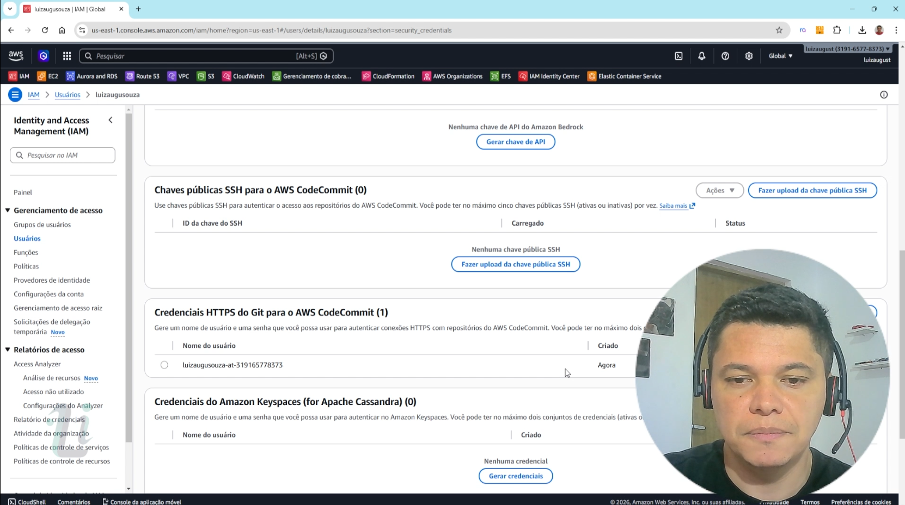
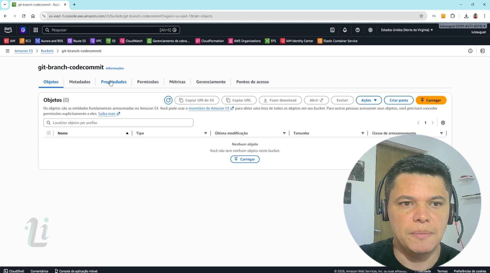
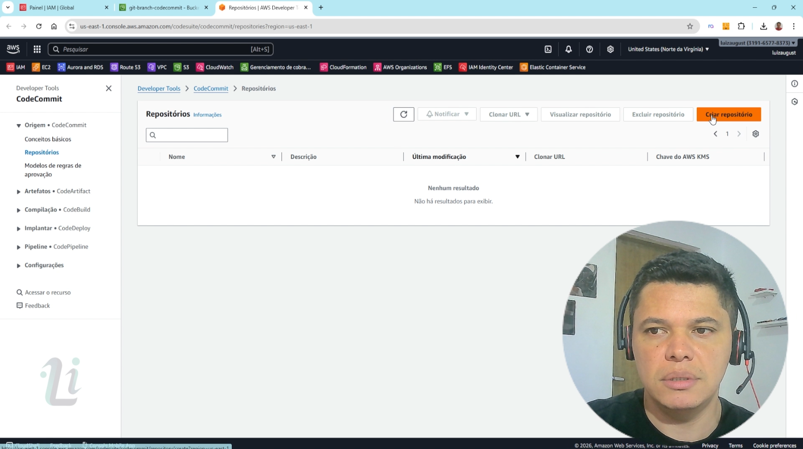
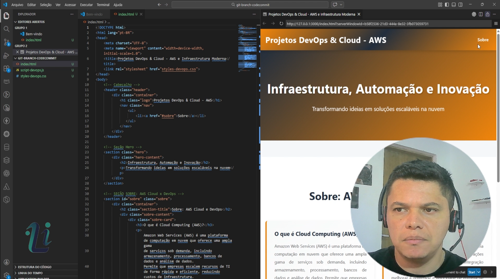
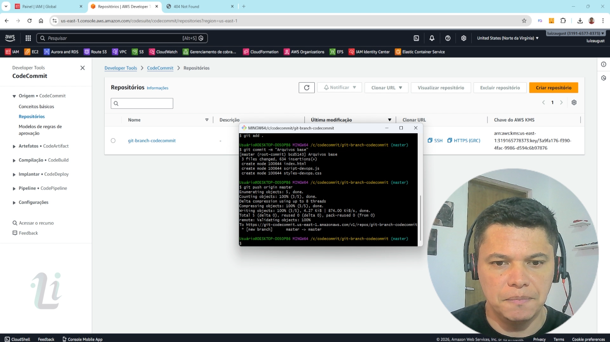
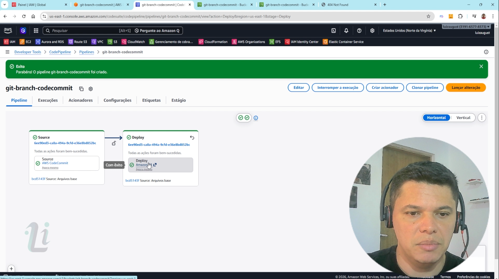
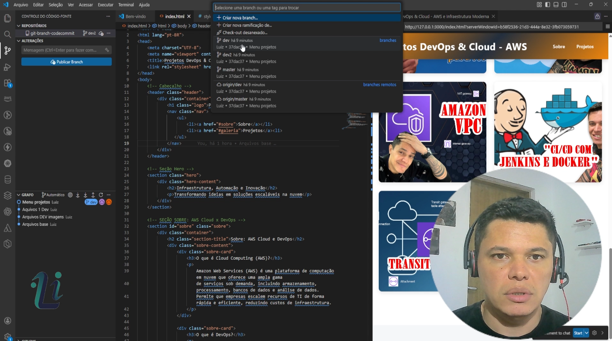
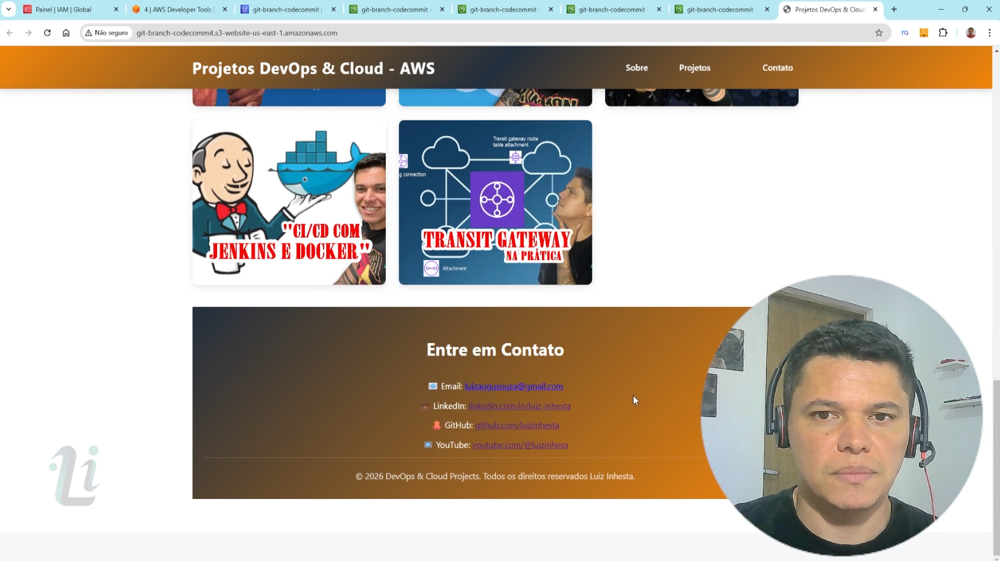

# 🚀 Projeto AWS CodeCommit + Git Branch + Pipeline para S3

.jpg)

Este projeto demonstra na prática a utilização de **Git com AWS
CodeCommit**, utilizando **branches para desenvolvimento de
funcionalidades** e **integração com AWS CodePipeline** para realizar o
deploy automático de um **site estático hospedado no Amazon S3**.

O objetivo do projeto é mostrar um fluxo comum utilizado em ambientes de
desenvolvimento, onde novas funcionalidades são desenvolvidas em
**branches separadas** e depois integradas à **branch principal
(master)**.

------------------------------------------------------------------------

# 🏗️ Infraestrutura

.png)

A arquitetura do projeto utiliza os seguintes serviços da AWS:

-   **AWS CodeCommit**\
    Repositório Git utilizado para armazenar e versionar o código.

-   **Git Branch**\
    Utilização de branches para desenvolvimento separado de
    funcionalidades.

-   **AWS CodePipeline**\
    Pipeline responsável por automatizar o processo de deploy.

-   **Amazon S3**\
    Hospedagem do site estático publicado automaticamente pelo pipeline.

Fluxo de funcionamento:

    Git (Local)
          ↓
    AWS CodeCommit (Repositorio)
          ↓
    AWS CodePipeline (Automação)
          ↓
    Amazon S3 (Site público)

------------------------------------------------------------------------

# 🌿 Fluxo de Branches Utilizado

Durante o desenvolvimento do projeto foram utilizadas três branches
principais:

-   **master**
    -   Branch principal responsável pelo deploy em produção
    -   Integração direta com o pipeline para publicação no S3
-   **dev**
    -   Utilizada para desenvolvimento de funcionalidades iniciais
-   **dev2**
    -   Utilizada para desenvolvimento de novas melhorias no projeto

------------------------------------------------------------------------

# 🔄 Etapas de Integração das Branches

Durante o projeto foram realizadas três formas diferentes de integração
de código.

### 1️⃣ Merge local utilizando Git

A primeira etapa consistiu em realizar o **merge da branch dev para a
master diretamente no Git local**, utilizando os comandos tradicionais
do Git.

Fluxo:

    dev → merge local → master

------------------------------------------------------------------------

### 2️⃣ Pull Request no AWS CodeCommit

Na segunda etapa foi realizada uma **solicitação de pull (Pull
Request)** no **AWS CodeCommit**, integrando:

    dev → Pull Request → master

Essa etapa demonstra o fluxo comum utilizado em equipes de
desenvolvimento.

------------------------------------------------------------------------

### 3️⃣ Pull Request da branch dev2

Na terceira etapa foi realizado outro processo de integração utilizando
o CodeCommit:

    dev2 → Pull Request → master

Com isso foi possível demonstrar diferentes formas de integração de
código utilizando Git e CodeCommit.

------------------------------------------------------------------------

# 🖼️ Galeria de Imagens do Projeto

> Nesta seção estão imagens demonstrando o funcionamento do projeto,
> infraestrutura e fluxo de desenvolvimento.

  
  
  

  
  
  

  
  

------------------------------------------------------------------------

# ⚙️ Tecnologias Utilizadas

-   AWS CodeCommit\
-   AWS CodePipeline\
-   Amazon S3\
-   Git\
-   HTML\
-   CSS

------------------------------------------------------------------------

# 🌐 Minhas redes

-   📺 **YouTube:**\
    https://youtu.be/M89Zw_ljDKE?si=IBPC4sf3BRR7IrMk

-   💼 **LinkedIn:**\
    https://www.linkedin.com/in/luiz-inhesta-341b4b311/

------------------------------------------------------------------------

# 👨‍💻 Autor

**Luiz Augusto**

Infrastructure • Cloud • Monitoring 🚀

------------------------------------------------------------------------

## 📌 Sobre este projeto

Este projeto foi desenvolvido com o objetivo de demonstrar na prática:

-   Utilização de **Git com múltiplas branches**
-   Estratégias de **merge local e pull request**
-   Integração entre **Git e AWS CodeCommit**
-   Automação de deploy utilizando **AWS CodePipeline**
-   Publicação de **site estático no Amazon S3**
-   Simulação de fluxo de desenvolvimento utilizado em ambientes DevOps
